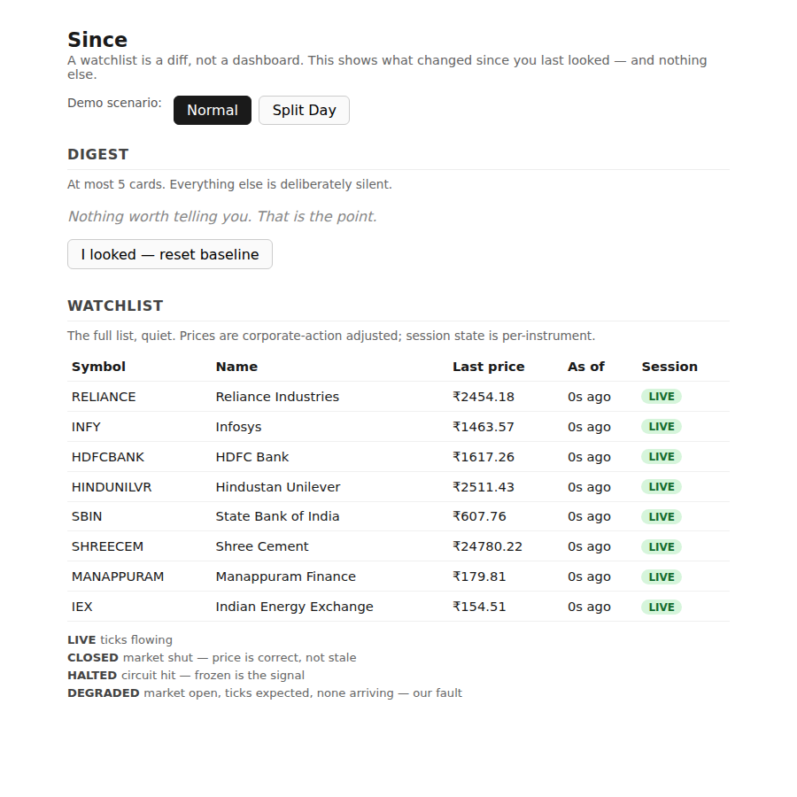
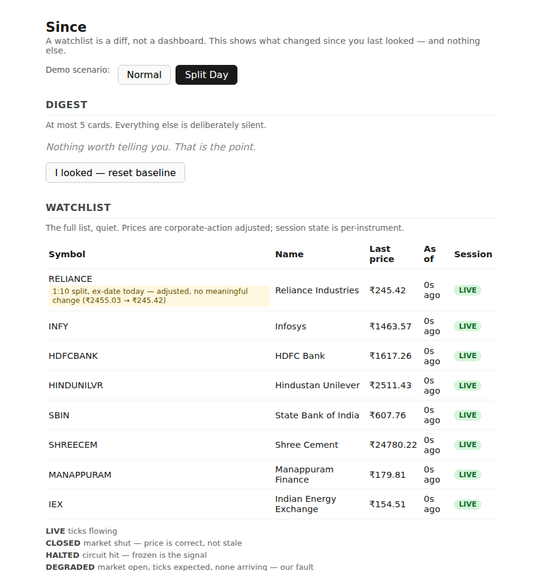
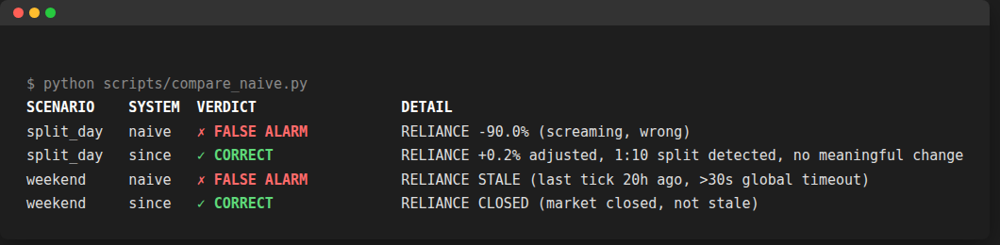

# Since

A watchlist is not a dashboard. It is a diff. A diff is only as good as its
baseline — so the entire engineering problem is whether the baseline can be
trusted.

`Since` answers "what did I miss?" instead of "what is this worth?" It tells
you what meaningfully changed since you last actually looked, and stays
silent about everything else.

## The three lies

A naive watchlist lies three ways. Each lie is one subsystem here.

**The baseline is not personal.** Naive systems diff against yesterday's
close. The correct baseline is whenever *this user* last actually looked,
held as a per-user, per-instrument watermark that only advances forward, by
server-assigned sequence number — never by client clock (`app/digest`).

**The baseline decays.** A 1:10 split takes a stock from ₹2455 to ₹245. A
naive watchlist reports **-90%** and ranks it the biggest move of the day,
because a 20-sigma move looks the most important — the cleverer the
scoring, the louder the lie. Nothing happened: the position is worth the
same, split across ten times the shares. `Since` carries a cumulative
adjustment factor per ISIN and reports the real move — **+0.2%** — with the
split named (`app/corpactions`). See `RESULTS.md` for the full comparison.

**The baseline expires.** Naive systems ship one `stale` flag on a global
timeout, so it fires every single weekend and gets ignored right when it
matters. Liveness here is judged per instrument, against that instrument's
own expected tick interval, across four states — `LIVE`, `CLOSED`, `HALTED`,
`DEGRADED` — where only `DEGRADED` is ever this system's fault
(`app/session`).

## Screenshots





## Setup

Requires Python 3.11+.

```bash
python3 -m venv .venv
.venv/bin/pip install -r requirements.txt

.venv/bin/uvicorn app.main:app --reload --port 8000
# open http://localhost:8000
```

Run the tests:

```bash
.venv/bin/pytest -q
```

Print the naive-vs-Since comparison table:

```bash
.venv/bin/python scripts/compare_naive.py
```

The demo page has a **Demo scenario** toggle (`Normal` / `Split Day`) and an
"I looked — reset baseline" button that advances the watermark, so you can
watch the digest go silent again.

`setup.sh` and the `Makefile` predate this build and still describe a
Vite/React frontend that isn't part of it — see `docs/BUGS.md`.

## Further reading

- [`docs/ARCHITECTURE.md`](docs/ARCHITECTURE.md) — module map, data model,
  request flow, and why a modular monolith on SQLite (conceptually — this
  build is in-memory) beats microservices and a message broker at this scale.
- [`docs/RESULTS.md`](docs/RESULTS.md) — the naive-vs-Since output table, annotated.
- [`docs/BUGS.md`](docs/BUGS.md) — known limitations, and what was skipped as
  a time cut vs. a deliberate design decision.

## Decisions & trade-offs

**No LLM anywhere in the scoring or ranking path.** A scorer you can't
unit-test is a scorer you can't defend. Every signal here is a pure function
over numbers — deterministic, seeded, and reproducible under Q&A pressure.

**No news, charts, price alerts, portfolio tracking, or social features.**
The brief rewards depth on one problem — trusting the baseline — not
breadth across a feature list. Every one of those is a different, well-worn
problem that would dilute the actual argument this project is making.

**No Kafka, no Redis, no message broker.** A few thousand instruments and a
tick-driven update loop don't need a distributed queue; they need one
process that applies ticks in order. Introducing a broker here would be
solving a scale problem this system doesn't have yet, at the cost of a
partial-failure mode it doesn't need yet either.

**No real market-data vendor.** A deterministic, seeded simulator makes
every failure mode — a split, a feed outage, a weekend — reproducible on
demand, which a real vendor feed fundamentally cannot promise during a live
demo. The vendor-adapter shape (`app/feed.SCENARIOS`, the `Tick` dataclass)
is there so a real feed is a second implementation of the same interface,
not a rewrite.

**SQLite, conceptually, over Postgres.** The write pattern is single-writer
(one ingest path), which is exactly what SQLite in WAL mode is for, with
zero operational surface. The interesting engineering problem is the schema
and the invariants it encodes (see `ARCHITECTURE.md`), not the storage
engine underneath it — and this build goes further still, holding that
schema's shapes as in-memory dataclasses rather than standing up even
SQLite, as a scope cut for the demo window (`BUGS.md`).
