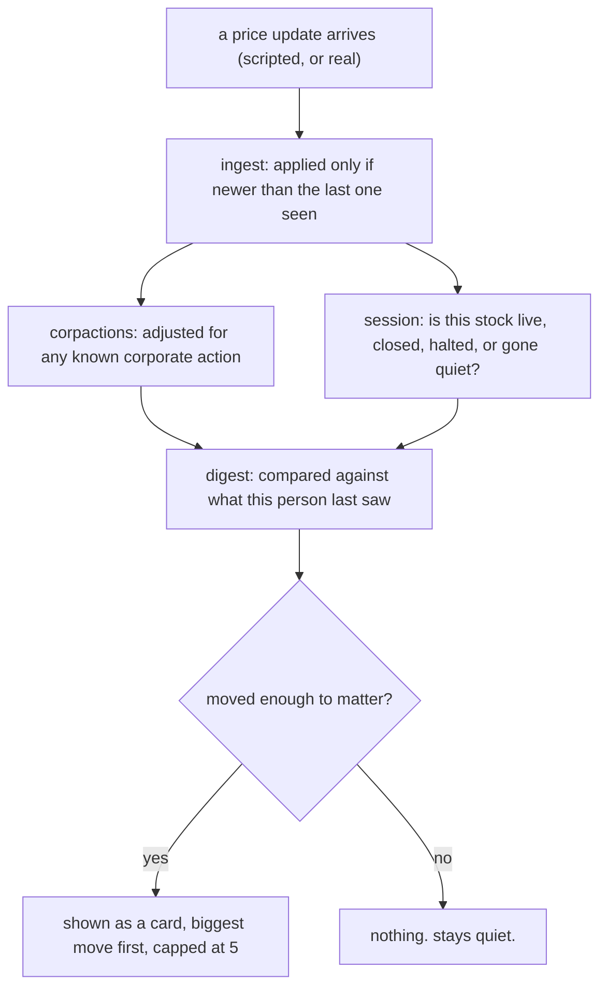
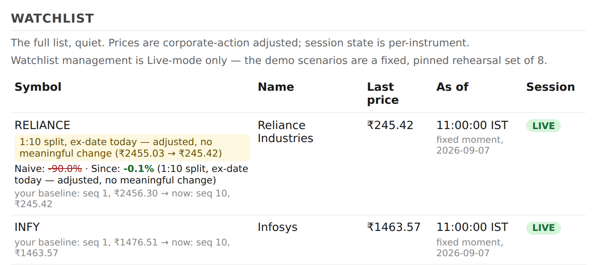
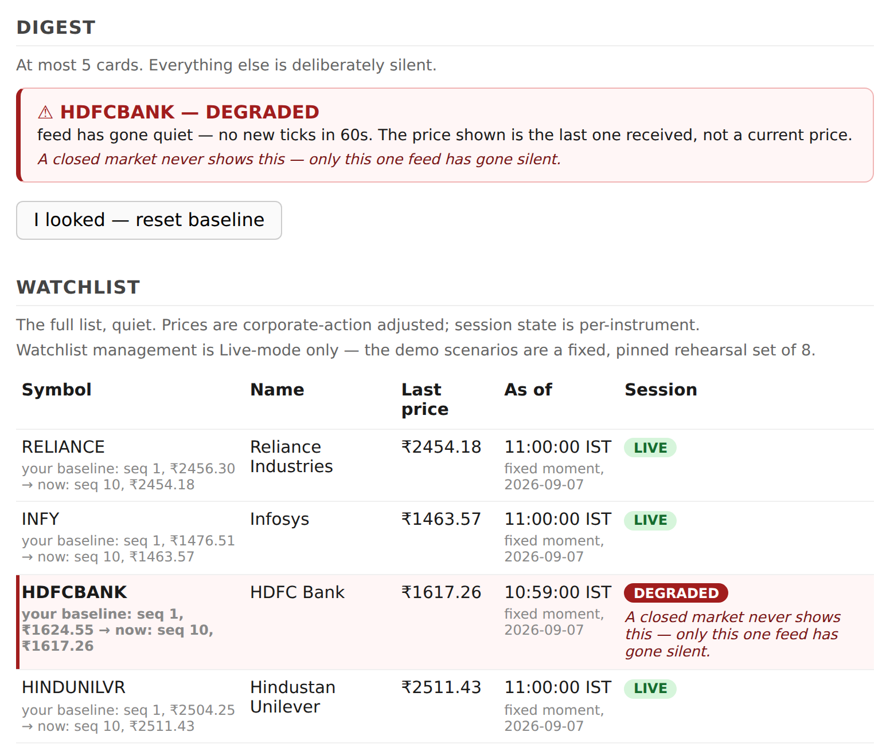
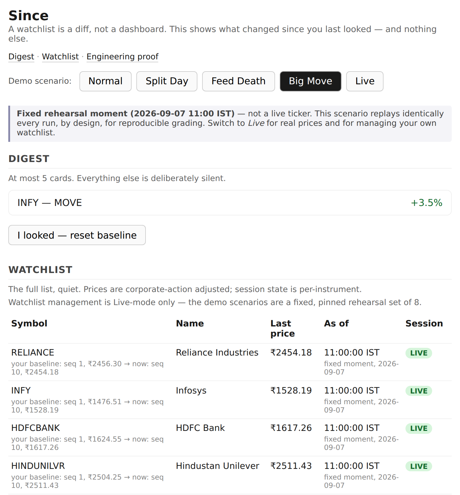
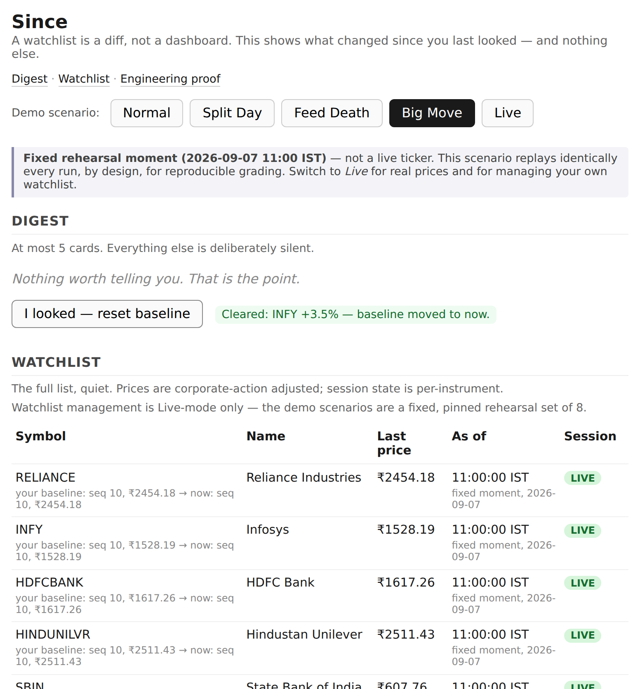

# Since

A market watchlist that answers "what did I miss?" instead of "what is this
worth?" It tells you what meaningfully changed since you personally last
looked, and stays quiet about everything else. Built solo for Groww's "Code"
hackathon.

## Table of contents

1. [The problem statement](#the-problem-statement)
2. [What was built, mapped to exactly what was asked](#what-was-built-mapped-to-exactly-what-was-asked)
3. [How it's built](#how-its-built)
4. [Watching it work: the three lies, live](#watching-it-work-the-three-lies-live)
5. [Running it](#running-it)
6. [What's honestly not built](#whats-honestly-not-built)
7. [Quick file map, for defending this live](#quick-file-map-for-defending-this-live)

---

## The problem statement

This is quoted directly from the brief, because everything below is written
to answer it point by point, not around it.

> **Build a Smart Market Watchlist.** Build a smart market watchlist that
> helps users not just track stocks, but quickly understand what has
> "meaningfully changed" since they last checked, and what deserves their
> attention now.
>
> At minimum, users should be able to:
> - Create and manage a watchlist
> - View latest market information
> - Return later and see what has changed
>
> You are expected to build both the frontend and backend. You decide:
> - What counts as a meaningful change
> - What information to surface
> - How state persists across sessions/devices
> - How to handle stale, delayed, or conflicting data
> - How the system scales for larger watchlists and more users
> - Where to keep things simple vs. add complexity
>
> There is no prescribed UI, feature set, or architecture. Don't build the
> obvious watchlist. Build the version you believe should exist, and be
> ready to explain why.

The obvious reading of that brief produces a live price grid, red and green
tiles, "here's what this stock is worth right now." That answers a question
nobody opens a watchlist to ask. The actual question in the brief is "what
did I miss," and that's a diff, not a display. A diff is only as good as its
baseline, so the real engineering problem, underneath the stated one, is
whether that baseline can be trusted. Three things break a baseline's
trustworthiness, and this project is three subsystems, one per break:

- It isn't personal. Diffing against yesterday's close ignores that "new"
  means something different for every person, depending on when *they*
  last looked.
- It decays. A stock split or bonus issue moves a price for reasons that
  have nothing to do with whether the stock is doing well, and a naive
  system reports that as a crash.
- It expires. A single "stale after 30 seconds" flag can't tell a closed
  market from a broken feed, so it either nags constantly or misses a real
  outage.

Everything from here on is how each of those three, plus the rest of the
brief's requirements, actually got answered in code.

---

## What was built, mapped to exactly what was asked

Each heading below is one line from the brief. Each one links straight to
the file that answers it, so you can click through from here into the
actual code.

### "Create and manage a watchlist"

Add a real NSE symbol, or remove one, while in Live mode. Adding calls
Yahoo's live quote endpoint to both validate the symbol and get its
starting price in one step; removing a custom addition deletes it, and
removing one of the curated 8 records that exclusion without touching the
underlying list the four scripted demo scenarios rely on. Both survive a
restart.

- [`app/main.py`](app/main.py): `watchlist_add`, `watchlist_remove`,
  `_current_instruments`, `_live_instruments`
- [`app/db.py`](app/db.py): `custom_instruments` and `excluded_instruments`
  tables, `save_custom_instrument`, `load_custom_instruments`,
  `save_excluded_isin`, `load_excluded_isins`
- [`app/static/index.html`](app/static/index.html): the add field and
  per-row remove button, shown only in Live mode

This is deliberately scoped to Live mode. The four scripted scenarios
(`normal`, `split_day`, `feed_death`, `big_move`) are a pinned rehearsal
set: they have
to replay identically every time to stay a reliable demo, so letting
someone add or remove an instrument mid-replay would work against the one
property that makes them useful. A personal watchlist, by contrast, is
naturally a live-market idea, so that's where it lives.

One disclosed simplification: a custom addition is keyed by its ticker
symbol, not a real ISIN, because there's no ISIN lookup available for an
arbitrary symbol typed in by a user. The curated 8 stay properly ISIN-keyed
throughout. Worth saying out loud if asked, not something to be caught on.

### "View latest market information"

Every scenario, including Live, returns real current data for every
instrument: last traded price, how long ago it last ticked, and its session
state.

- [`app/main.py`](app/main.py): `GET /api/watchlist`
- [`app/feed/__init__.py`](app/feed/__init__.py): `SCENARIOS` (the
  deterministic replays) and `fetch_live_quote` / `fetch_live_ticks` (the
  real Yahoo Finance feed for 8 Indian stocks, refreshed every 10 seconds)

### "Return later and see what has changed"

This is the core of the whole project, not a checklist item. A personal
"watermark," per user and per instrument, remembers the exact tick you last
acknowledged. Coming back later diffs the current state against that
watermark, not against a shared clock, and shows only what moved enough to
matter.

- [`app/digest/__init__.py`](app/digest/__init__.py): `Watermark`,
  `WatermarkStore`, `build_digest`
- [`app/main.py`](app/main.py): `GET /api/digest`,
  `POST /api/watermark/ack`
- [`app/static/index.html`](app/static/index.html): the digest section,
  the "I looked" button, and the per-row line showing your own baseline
  (`your baseline: seq X, ₹Y → now: seq Z, ₹W`) so the mechanism isn't
  hidden behind its own effect

### "What counts as a meaningful change"

A 2% move, after adjusting for any corporate action. Below that, the digest
stays silent on purpose.

- [`app/digest/__init__.py`](app/digest/__init__.py): `MOVE_THRESHOLD = 0.02`

### "What information to surface"

At most 5 cards, biggest move first, everything else silent. A quiet day is
meant to look quiet, not padded out to look busy.

- [`app/digest/__init__.py`](app/digest/__init__.py): `DEFAULT_BUDGET = 5`,
  the sort-and-truncate at the end of `build_digest`

### "How state persists across sessions/devices"

A user's watermark is written to SQLite the moment it changes and reloaded
before the very first scenario replay on startup, so a real process restart
doesn't lose someone's "I looked" position. Proven by an actual restart,
not just reasoning: kill the server, start a new one, the position is still
there.

- [`app/db.py`](app/db.py): the `watermarks` table, `save_watermark`,
  `load_watermarks`
- [`app/main.py`](app/main.py): `_startup`
- [`tests/test_main.py`](tests/test_main.py):
  `test_persisted_watermark_survives_the_startup_replay`

Honest limit, already known rather than hidden: there's one hardcoded user
(`USER = "demo"`) in this build, so "across devices" means across restarts
of the same single account, not two different real people. See
[`docs/BUGS.md`](docs/BUGS.md).

### "How to handle stale, delayed, or conflicting data"

This is where most of the engineering actually lives.

- Out-of-order or duplicate ticks are dropped, never applied backwards:
  [`app/ingest/__init__.py`](app/ingest/__init__.py), `apply_tick`.
- A stock's data is reported as one of five states, judged per instrument
  against its own expected tick interval, not one global timeout:
  [`app/session/__init__.py`](app/session/__init__.py),
  `instrument_session_state`.
- A price jump that looks like an unrecorded split or bonus is flagged as
  unverified rather than trusted or discarded:
  [`app/corpactions/__init__.py`](app/corpactions/__init__.py),
  `detect_clean_ratio_gap`.

### "How the system scales for larger watchlists and more users"

Measured, not just argued. The expensive part of processing a price tick
happens once per instrument, shared across every viewer, not recomputed per
user. `scripts/benchmark_fanout.py` runs this against 3,000 synthetic
instruments and 1,000 simulated users and prints the real numbers, which
are also shown in the running app itself now, not only in a script's
output.

- [`scripts/benchmark_fanout.py`](scripts/benchmark_fanout.py)
- [`docs/ARCHITECTURE.md`](docs/ARCHITECTURE.md): "Why per-instrument
  fan-out, not per-user computation"
- [`app/static/index.html`](app/static/index.html): the "Engineering
  proof" section at the bottom of the page

### "Where to keep things simple vs. add complexity"

One process, one small database, plain HTML with no framework. Complexity
was added only where the brief's own hard problems actually live (the
three lies above), not anywhere else. The full reasoning for each of these
calls is in [`docs/ARCHITECTURE.md`](docs/ARCHITECTURE.md).

---

## How it's built

```
app/
├── main.py             the web server: every route a browser or script talks to
├── models.py           the plain shapes everything else is built from
├── db.py               SQLite (WAL): a user's watermark and watchlist choices
├── feed/               where prices come from: real Yahoo data, and a rehearsal tool
├── ingest/             applies a price update only if it's actually newer
├── corpactions/        tells a real stock split apart from a price crash
├── session/            says whether a stock's data is live, closed, halted, or gone quiet
├── digest/             the personal baseline diff and the 5-card budget
├── naive/              a deliberately simple, wrong version, kept to show why it's wrong
└── static/index.html   the one page a browser renders: plain HTML, no framework

tests/     one file per module above, proving its rules hold, plus test_main.py for the HTTP layer
scripts/
├── compare_naive.py     naive vs. Since, side by side, on the same data
└── benchmark_fanout.py  the cost of serving many people vs. one

docs/
├── ARCHITECTURE.md     the big-picture design and why each call was made
├── LLD.md              the detailed design: every outcome, tied to its test
├── BUGS.md             known limitations, stated plainly
├── RESULTS.md          the naive-vs-real comparison, explained
├── CLAUDE.md / PRD.md  the original planning documents
└── screenshots/        images used throughout this file
```

| Piece | What it's for | Why this one |
|---|---|---|
| Python 3.11+ | the whole backend | the standard library alone covers most of it |
| FastAPI | the web server and API | typed request handling without writing it by hand |
| Uvicorn | runs the server | comes with FastAPI |
| SQLite (WAL mode) | a user's saved position and watchlist choices | one process writing, many cheap reads, zero setup |
| httpx | live prices, and the test client | already needed for testing FastAPI, reused for the live feed |
| pytest | the test suite | the standard choice |
| Plain HTML, CSS, JS | the one page rendered | a handful of buttons and tables doesn't need a build step |

How one price update actually moves through the system:



Why a modular monolith and not microservices, and why SQLite and not
Postgres: both are argued in full in
[`docs/ARCHITECTURE.md`](docs/ARCHITECTURE.md), but the short version is
that a few thousand instruments and a handful of users don't have the
failure modes that either extra piece of infrastructure would be solving
for. Paying for that complexity now, for a problem this system doesn't have
yet, isn't simplicity's opposite, it's the same judgment call in reverse.

---

## Watching it work: the three lies, live

### The price lie

A 1:10 stock split takes Reliance from roughly ₹2,455 to roughly ₹245.
Nothing wrong happened to the data. A watchlist that just subtracts the two
numbers reports **-90%** and ranks it as the biggest move of the day,
because the bigger a move looks, the more urgent it seems. That's exactly
backwards: the shareholder's position is worth what it was worth the day
before, just split across ten times as many shares. Since tracks a
cumulative adjustment factor per instrument and reports the real move,
**-0.1%**, essentially flat, with the split named plainly next to it. The Split Day button in
the app now shows both numbers side by side on the affected row, so the
contrast doesn't require doing the naive math in your head.



### The staleness lie

Say the last real update landed Friday afternoon. A watchlist that checks
"quiet for more than 30 seconds" reports **stale** by Saturday morning, and
keeps reporting it all weekend. A warning that fires on a predictable
schedule regardless of whether anything is wrong is a warning people learn
to ignore, which means it has already stopped working by the time it's
needed. Since asks a different question first: is the market even open?
**Closed** is reported correctly, every time; only a stock that's silent
*while the market is open* is ever treated as the system's own fault, and
shown as **degraded**, not stale.



### The personal-baseline lie

"What's new" depends on when *you* last looked, not a shared clock. Since
tracks that per person, per instrument, as a watermark that only ever moves
forward. Pressing "I looked" moves it to now, and the digest goes quiet
until something genuinely new happens after that point. It also says out
loud what it just cleared, instead of the cards silently disappearing. The
Big Move button is the scenario that exercises this end to end: INFY moves
+3.5%, one card appears, "I looked" clears it, and every row's baseline
advances to the tick you just acknowledged.




Full walkthrough of both scripted comparisons, printed and explained line
by line, is in [`docs/RESULTS.md`](docs/RESULTS.md).

---

## Running it

Requires Python 3.11+.

```bash
python3 -m venv .venv
.venv/bin/pip install -r requirements.txt

.venv/bin/uvicorn app.main:app --reload --port 8000
# open http://localhost:8000
```

Run the tests:

```bash
.venv/bin/pytest -q
```

Print the naive-vs-Since comparison on the same scripted data:

```bash
.venv/bin/python scripts/compare_naive.py
```

Measure the cost of serving many people vs. one:

```bash
.venv/bin/python scripts/benchmark_fanout.py
```

The page has five scenario buttons. Normal, Split Day, Feed Death and Big
Move each replay a scripted, second-by-second session from a fixed
starting point:
the same "day," exactly the same way, every run, on purpose, so a real
stock split or feed outage can be demonstrated on command rather than
waited for. Live pulls real current prices for eight Indian stocks and
refreshes every 10 seconds; it's also the only mode where you can add or
remove instruments from your own watchlist.

---

## What's honestly not built

The full, honest list, including which gaps are a time constraint and
which are a deliberate choice, is [`docs/BUGS.md`](docs/BUGS.md). The ones
most worth knowing going in:

- One hardcoded user. There's no real multi-user auth, so "across devices"
  in this build means across restarts of the same account.
- No volume cross-check on the unconfirmed-corporate-action detector. It
  catches a clean-ratio price shape, not a real split's usual trading-volume
  signature, so a rare coincidental price glitch could still be flagged the
  same as a real one.
- No cooldown on a price oscillating right at the 2% threshold. It's a real
  gap: a card can flicker in and out of the digest as a price bounces around
  the line, not just cross it once.
- A custom watchlist addition is keyed by ticker symbol, not a real ISIN,
  because there's no ISIN lookup for an arbitrary symbol. The curated 8
  stay properly ISIN-keyed.
- No WebSocket streaming. Live mode is client-driven polling every 10
  seconds, not a server push.

---

## Quick file map, for defending this live

| If asked about | Look at |
|---|---|
| The core thesis, why a diff and not a dashboard | [`README.md`](#the-problem-statement) top, [`docs/CLAUDE.md`](docs/CLAUDE.md) |
| The personal baseline / watermark | [`app/digest/__init__.py`](app/digest/__init__.py) |
| The corporate-action math (the split example) | [`app/corpactions/__init__.py`](app/corpactions/__init__.py) |
| The unverified-corporate-action check | [`app/corpactions/__init__.py`](app/corpactions/__init__.py), `detect_clean_ratio_gap` |
| The five session states / degraded vs. closed | [`app/session/__init__.py`](app/session/__init__.py) |
| Tick ordering / dropping out-of-order updates | [`app/ingest/__init__.py`](app/ingest/__init__.py) |
| Watchlist add/remove | [`app/main.py`](app/main.py), `watchlist_add` / `watchlist_remove` |
| Persistence across a restart | [`app/db.py`](app/db.py), [`app/main.py`](app/main.py) `_startup` |
| The live Yahoo feed, and the IST timezone bug it caught | [`app/feed/__init__.py`](app/feed/__init__.py), [`docs/ARCHITECTURE.md`](docs/ARCHITECTURE.md) "The live feed" |
| The naive baseline, kept deliberately wrong | [`app/naive/__init__.py`](app/naive/__init__.py), [`scripts/compare_naive.py`](scripts/compare_naive.py) |
| The fan-out / scaling claim and its real numbers | [`scripts/benchmark_fanout.py`](scripts/benchmark_fanout.py), [`docs/ARCHITECTURE.md`](docs/ARCHITECTURE.md) |
| The concurrency lock and its stress test | [`app/main.py`](app/main.py) `_lock`, [`tests/test_main.py`](tests/test_main.py) |
| Why a monolith, why SQLite | [`docs/ARCHITECTURE.md`](docs/ARCHITECTURE.md) |
| Every known gap, and whether it's a time cut or a choice | [`docs/BUGS.md`](docs/BUGS.md) |
| Exact fields, every outcome, the test that proves each one | [`docs/LLD.md`](docs/LLD.md) |

AI tools were used for scaffolding, wording, and iteration speed. The
underlying framing (three specific ways a naive watchlist lies, and one
subsystem answering each), every module boundary, and every trade-off on
this page was a decision made and owned by the author, not outsourced.

## License

MIT, see [`LICENSE`](LICENSE).
