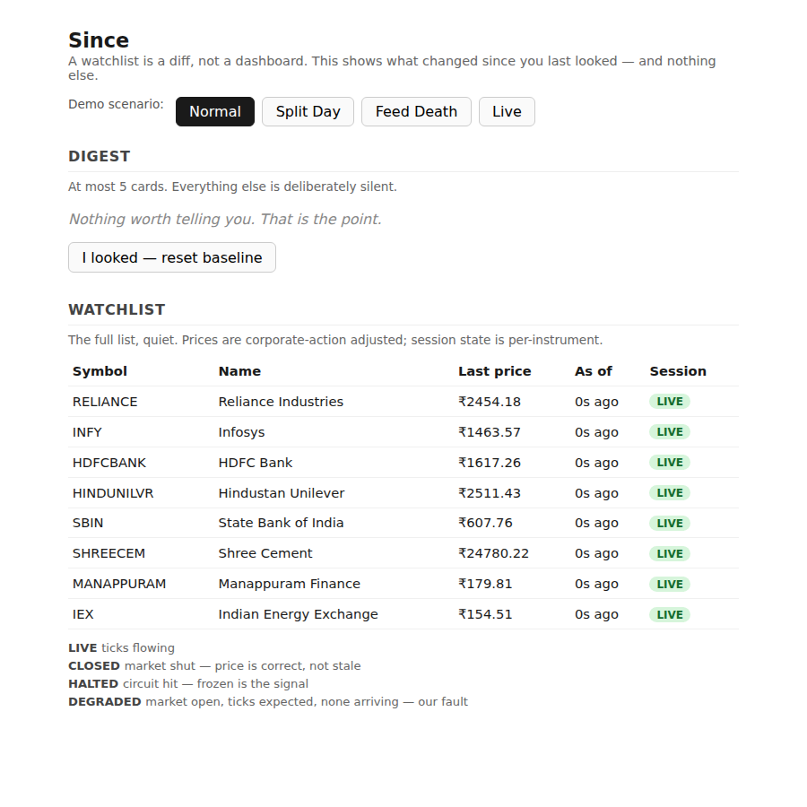
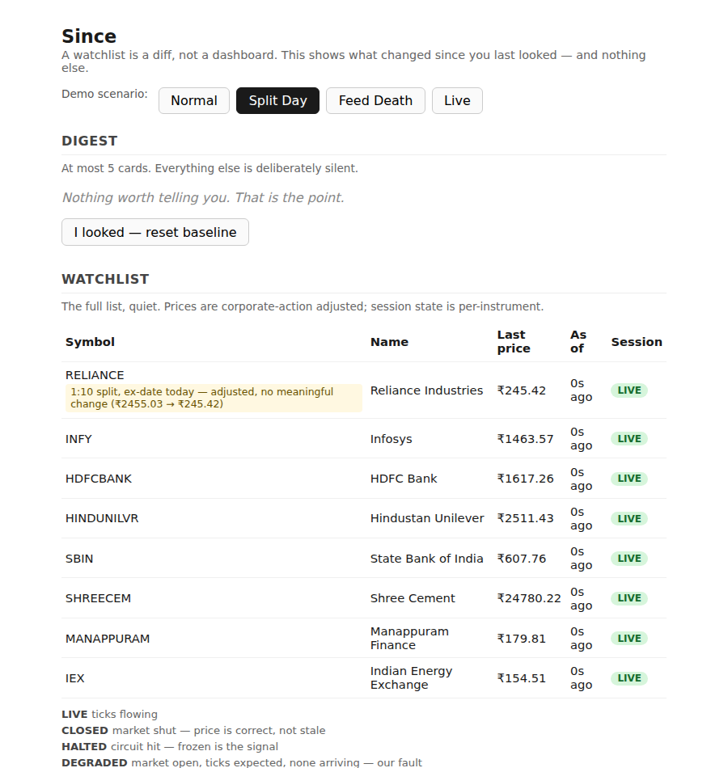

# Since

A watchlist is not a dashboard. It is a diff. A diff is only as good as its
baseline — so the entire engineering problem is whether the baseline can be
trusted.

Since answers "what did I miss?" instead of "what is this worth?" It tells
you what meaningfully changed since you last actually looked, and stays
silent about everything else.

## Screenshots





## What it does

- Opens to a short digest — what genuinely changed — sitting above the full
  watchlist.
- A card only appears when a price has moved meaningfully since you
  personally last looked at that stock. Nothing else makes noise.
- A stock split or bonus issue is recognized and explained in the moment it
  happens, not mistaken for a price crash.
- A price jump that doesn't match any known corporate action is flagged as
  unconfirmed instead of being silently trusted or silently ignored.
- When a stock's data feed goes quiet, that's shown plainly, in its own
  word, never disguised as a live, current price.
- A closed market is never confused with a broken one — those are different
  facts and get different words.
- The digest is capped at five cards, on purpose. A quiet day looks quiet.

## How to run it

Requires Python 3.11+.

```bash
python3 -m venv .venv
.venv/bin/pip install -r requirements.txt

.venv/bin/uvicorn app.main:app --reload --port 8000
# open http://localhost:8000
```

Run the tests:

```bash
.venv/bin/pytest -q
```

Print the comparison between a naive watchlist and this one, on the same
scripted data:

```bash
.venv/bin/python scripts/compare_naive.py
```

Measure how the cost of serving many people compares to serving one:

```bash
.venv/bin/python scripts/benchmark_fanout.py
```

The page has four scenario buttons. **Normal**, **Split Day**, and **Feed
Death** each replay a scripted, second-by-second trading session from a
fixed starting point — the same "day," exactly the same way, every time.
**Live** pulls real current prices for eight Indian stocks and refreshes
them every ten seconds. An "I looked" button resets your personal baseline,
so the digest goes quiet again until something new actually happens.

`setup.sh` predates this build and still describes a different frontend
that isn't part of it — see `docs/BUGS.md`.

## How the project is organized

```
app/
├── main.py            the web server — every route a browser or script talks to
├── models.py           the plain shapes everything else is built from (a stock, a price update)
├── db.py               saves a person's position to disk so it survives a restart
├── feed/                where prices come from — a real source, and a rehearsal tool for rare events
├── ingest/              applies a price update only if it's actually newer than the last one
├── corpactions/         tells a real stock split apart from a price crash, and flags anything unexplained
├── session/             says whether a stock's data is live, closed, halted, or gone quiet
├── digest/              remembers what a person last saw and decides what's worth telling them now
├── naive/               a deliberately simple, wrong version, kept only to show why it's wrong
└── static/index.html    the single page a browser actually renders — plain HTML, no framework

tests/                  one file per part above, proving its rules actually hold
scripts/
├── compare_naive.py     prints the naive version and this one side by side, on the same data
└── benchmark_fanout.py  measures the cost of serving many people at once

docs/
├── ARCHITECTURE.md      the big-picture design
├── LLD.md               the detailed design — exact behavior, pinned to the test that proves it
├── BUGS.md              known limitations, stated plainly
├── RESULTS.md           the naive-vs-real comparison, explained
├── CLAUDE.md / PRD.md   the original planning documents, kept as written
└── screenshots/         images embedded above and throughout this file

requirements.txt        exact, pinned dependency versions
setup.sh                one script: create a virtual environment, install, run the tests
LICENSE                 MIT
```

## What's in each doc

| Doc | What's in it |
|---|---|
| [`docs/ARCHITECTURE.md`](docs/ARCHITECTURE.md) | the big-picture design — module map, data model, how a request flows through the system, and why it's shaped this way (one process instead of several, SQLite instead of a bigger database, a real feed for prices alongside a rehearsal tool for rare events) |
| [`docs/LLD.md`](docs/LLD.md) | the detailed design — exact fields, every distinct outcome each part can produce, what happens at the edges, and the specific test that proves each claim |
| [`docs/BUGS.md`](docs/BUGS.md) | known limitations, stated plainly — what isn't built yet, and whether that was a time constraint or a deliberate choice |
| [`docs/RESULTS.md`](docs/RESULTS.md) | the naive-vs-real comparison from `compare_naive.py`, walked through line by line |
| [`docs/CLAUDE.md`](docs/CLAUDE.md) | the original design brief this project was built against, kept as written |
| [`docs/PRD.md`](docs/PRD.md) | the original product requirements doc, kept as written |

## Tech stack

| Piece | What it's for | Why this one |
|---|---|---|
| Python 3.11+ | the whole backend | the standard library alone covers most of what's needed here (SQLite, timezones) — no reason to reach further |
| FastAPI | the web server and API | typed request handling and validation without writing that by hand |
| Uvicorn | runs the server | the standard server FastAPI itself is built to run under |
| SQLite, stdlib `sqlite3`, WAL mode | saving a person's position to disk | one process writing, many cheap reads — exactly what SQLite is for, with zero setup |
| httpx | fetching real prices, and running the test client | already needed for testing FastAPI apps, so pulling real prices with it added nothing new to install |
| pytest / pytest-asyncio | the test suite | plain and widely known — nothing fancier is needed at this size |
| Plain HTML, CSS, and JavaScript, no framework | the one page a browser renders | a single page with four buttons and two tables doesn't need a build step |

## The project in detail

This section walks through what each part actually does and what would go
wrong without it — not just that a feature exists, but what it's for.

### Where prices come from

Two sources feed the exact same pipeline. One is real: current prices for
eight Indian stocks (Reliance, Infosys, HDFC Bank, Hindustan Unilever,
State Bank of India, Shree Cement, Manappuram Finance, and the Indian
Energy Exchange), pulled from a public market-data source with no account
or key needed. The other is a rehearsal tool: a handful of scripted
scenarios that replay a realistic trading session from a fixed starting
point, so the same "day" happens exactly the same way no matter how many
times it's run.

A real stock split, or a real market-data outage, cannot be scheduled to
happen during a specific ten-minute window. A system that claims to handle
either one needs to be shown actually doing so, not just asserted to. That's
what the scripted scenarios are for — proof the handling works, on command,
not a promise that it would.

### What a stock split would otherwise do to the numbers

A 1:10 stock split takes a share price from roughly ₹2,455 to roughly ₹245.
That's a real, correct number — nothing wrong happened to the data. A
watchlist that just subtracts the old price from the new one reports
**-90%**, and would rank it as the single biggest move of the day, because
the bigger a move looks, the more urgent it seems. That's backwards: the
shareholder's position is worth exactly what it was worth the day before,
just split across ten times as many shares. This system tracks each
corporate action as an adjustment and reports the real move — **+0.2%**,
the actual, tiny price change that day — with the split named plainly
alongside it. Run `scripts/compare_naive.py` to see both numbers side by
side, computed from the same data.


### What a closed market would otherwise look like

Say the last real price update came in Friday afternoon, before the market
closed for the weekend. A watchlist that checks "has it been quiet for more
than 30 seconds?" reports **stale** by Saturday morning — a warning that
fires every single weekend, forever, whether anything is actually wrong or
not. A warning a person learns to expect and ignore on schedule has already
stopped working: the first time something is genuinely broken, it looks
exactly like every other quiet weekend. This system asks a different
question first — is the market even open right now? — before it ever asks
whether a particular stock has gone quiet. A closed market reports
**closed**, correctly, every time. Only a stock that's unexpectedly silent
*while the market is open* is ever treated as the system's own fault.

### What an unconfirmed price jump looks like

A real stock split or bonus issue moves a price by a clean, recognizable
ratio — half, a fifth, a tenth, a twentieth of what it was, or the reverse.
This system watches for exactly that shape. When a price jumps by one of
those clean ratios and there's no record of a real corporate action behind
it, it's flagged as unconfirmed and held back from being reported as a
genuine price move — never silently trusted, and never silently thrown
away either. An ordinary price move essentially never lands precisely on
one of those ratios, so this stays a quiet, narrow check rather than a
noisy one.

### What a quiet feed looks like

Sometimes a data source stops sending updates for one particular stock
while the market is still open and every other stock keeps ticking
normally. That's a different problem from a closed market, and it gets a
different word: the affected stock is marked as having gone quiet, its
price is labeled as the last one actually received rather than a current
one, and it's never scored as if a real price move had just happened.


### What happens when you say "I looked"

Every person's sense of "what's new" is personal — it depends on when they
themselves last checked, not on some shared clock. That position is tracked
per person, per stock, and it only ever moves forward: looking at an older
snapshot (say, from a second device that's behind) can never accidentally
rewind it. Pressing "I looked" moves that position up to the current
moment, and the digest goes quiet again until something genuinely new
happens after that point.


### What survives a restart

A person's "I looked" position is saved to disk the moment it changes, and
loaded back the moment the server starts up again — so restarting the
service doesn't make it forget what someone had already seen. Market data
itself is treated differently on purpose: switching between scenarios
always starts that scenario over from a clean, predictable beginning, so a
scripted demonstration behaves exactly the same way every time it's shown,
regardless of what happened to be left over from a previous run.

## Key design decisions

**A personal position is tracked by a count, not a clock.** Every device's
clock can be wrong or out of sync with every other device's. What can't be
faked is a count that only ever goes up, assigned by the server itself —
so two devices can't corrupt each other's sense of "what's new."

**An unconfirmed price jump is flagged, not guessed at.** The check looks
for a specific, recognizable shape — a clean ratio with no matching record
— and deliberately doesn't try to catch everything. A jump that doesn't
have a clean, round shape passes through unflagged; that's a known,
accepted gap, not a hidden one.

**Shared data is protected from being read half-updated**, and a
person's saved position durably survives a restart. Both are real,
working, and tested — including by actually restarting the running service
and confirming the position was still there afterward, not just by
reasoning that it should be.

**The cost of serving many people was measured, not just argued.** Running
the actual code against thousands of simulated stocks and a thousand
simulated people showed that serving the thousandth person costs about the
same, per person, as serving the first — because the expensive part of the
work happens once, shared, rather than being repeated for every viewer.

**Some things are deliberately left out**, and said so plainly rather than
hidden: a cooldown so a flickering price near the threshold doesn't
re-trigger every few seconds, three additional kinds of alert beyond a
plain price move, and a way to re-check a corporate action against trading
volume for extra confidence. Each is a real gap, named honestly, not
quietly worked around.

**This is a second pass, not the first.** The system was built, then
deliberately hardened afterward — closing gaps that were already known and
disclosed, not discovered for the first time under pressure.

**AI tools were used for scaffolding, wording, and iteration speed.** The
underlying framing — three specific ways a naive watchlist lies, and one
subsystem answering each — along with every module boundary and every
trade-off on this page, was a decision made and owned by the author, not
outsourced.

**A real stock split isn't shown happening live**, on purpose. Real prices
drive everything shown live; a real split or a real outage can't be
scheduled to occur during a short, specific demonstration window, so those
are shown through the same scripted rehearsal tool described above instead
— running through the exact same detection logic either way. Only where
the price comes from differs.

## License

MIT — see [`LICENSE`](LICENSE).
